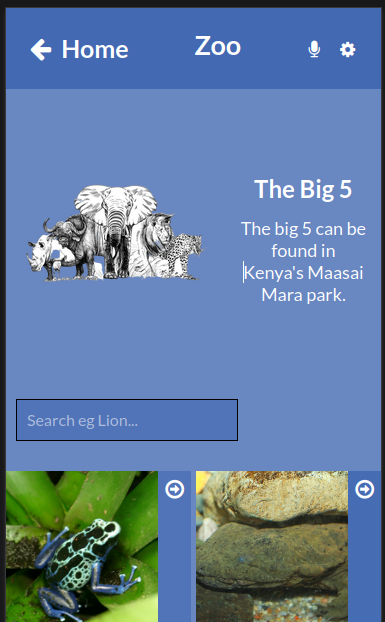
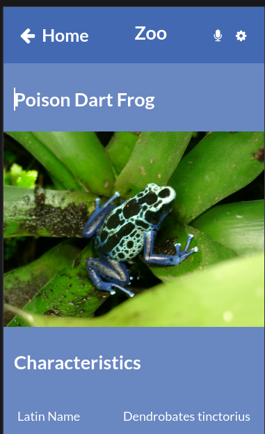
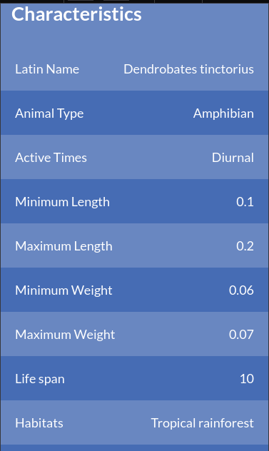

# Nemwel ZOO

Nemwel Zoo is a mobile web application that I built for my love for wild life. It features two pages: A home page and a Details page each with its own route.

The home page displays 10 random images displaying the name, animal type eg `Mammal` and its image. It also allows you to be able to click on an image to give you more information about that specific animal.

The details page is where all the information about a specific animal is displayed including its name, latin name, life span, habitats and so much more.

All the information is got from the [Zoo API](https://zoo-animal-api.herokuapp.com) which is a free open source API.

Enjoy!

## Built With

- HTML5
- CSS
- Javascript
- React
- Redux
- API
- Webpack
- Linters

## Live Demo

This project was deployed to two places:
- [Netlify](https://deploy-preview-9--serene-salamander-3dcead.netlify.app/)
- [Heroku]() none at the moment

## Video Demo

I did a video demo of the project which can be viewed below:
- [Loom](https://www.loom.com/share/e18ffb9c5d8f4f55afa3e5601ff40cee)

## Getting Started

To get a local copy up and running follow these simple example steps.

## Install

In your terminal, navigate to your current directory and run this code

`git@github.com:Nemwel-Boniface/zoo.git`

Locate the directory in your file explorer

`cd zoo`

Install npm or if installed already using this link

`npm install`

Start the web dev server depending on your configuration

`npm start`

The Project should now be live on your browser

## Authors

👤 **Author1**

- GitHub: [@Nemwel-Boniface ](https://github.com/Nemwel-Boniface)
- Twitter: [@nemwel_bonie](https://twitter.com/nemwel_bonie)
- LinkedIn: [LinkedIn](https://www.linkedin.com/in/nemwel-nyandoro-aa1b2620b/)

Contributions, issues, and feature requests are welcome!

Feel free to check the [issues page](https://github.com/Nemwel-Boniface/zoo/issues).

## Acknowledgments

Special thank you to [Nelson Sakwa](https://www.behance.net/sakwadesignstudio) for providing this awesome design.

## Show your support

Give a ⭐️ if you like this project!
## 📝 License

This project is [MIT](./MIT.md) licensed.